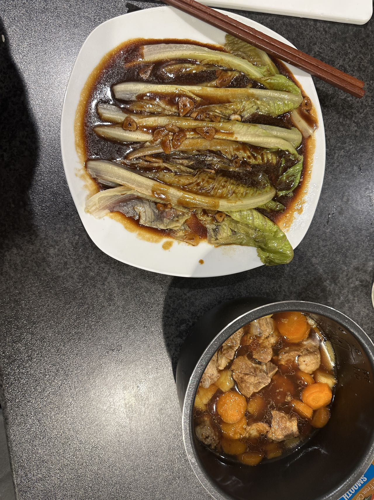

# This is Mia's terrible website

Here's a gif of elmo

You can add text

* and lists
* with extra bullets

You can *FORMAT* and **bold?**

This is a [link](https://www.google.com/) to a good data science tool. Here's a link to [P8105](https://p8105.com). Here's a link to the [about](about.html) page.

# Here's a strange new section

This is what mzw done for meal.

You can also use R
